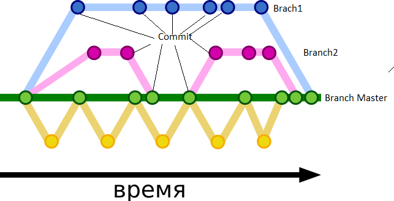

[<- к содержанию](./readme.md)

## Ветвления 

**Ветвление** - это создание различных версий репозиториев, отличных друг от друга.

**Создание ветки и переключение на ветку**:

-> [git branch](./branch.md)

-> [git checkout](./branch.md)

**Объединение ветвей**:

-> [git merge](./merge.md)

Комманда _git merge_ производит слияние веток, но так же существует комманда _git rebase [name branch]_ -  этом случае коммиты вашей ветки накладываются поверх текущего состояния указанной ветки.