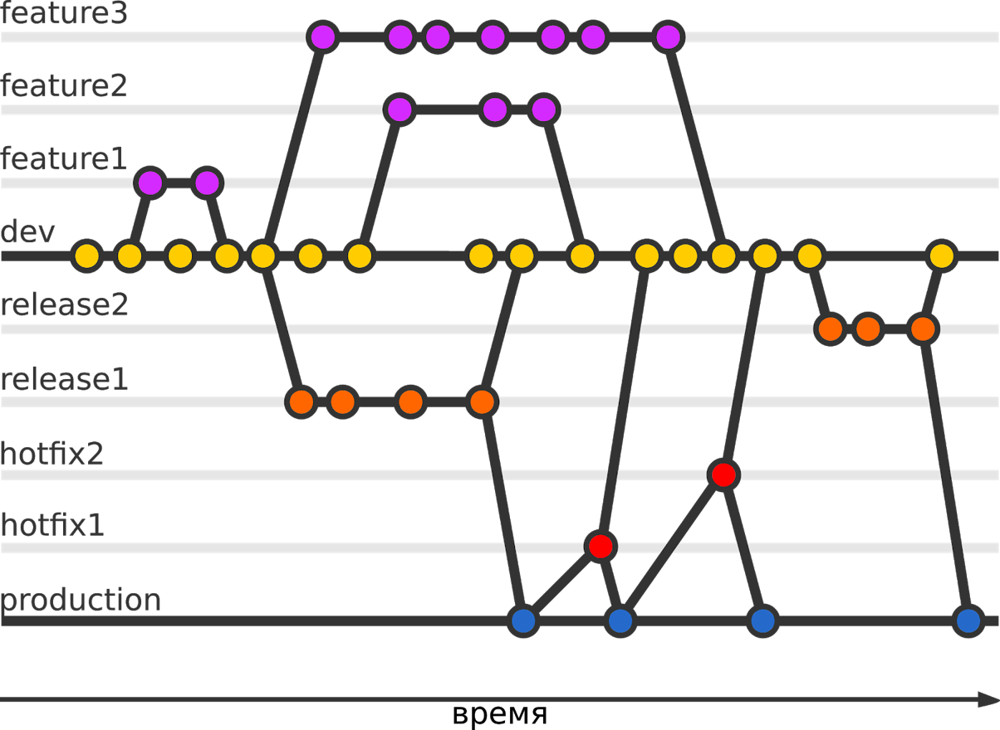

[<- к содержанию](./readme.md)

## Модели ветвления
---
---

## `1. Central Workflow` 
 Репозиторий содержит только одну главную ветку master, подходит для одиночного проекта

---

## `2. Developer Branch Workflow` 
 У каждого разработчика есть своя личная ветка или несколько, в которые он вносит изменения. Все изменения, опубликованные в удаленном репозитории будут в этой ветке. Вся работа может быть выполнена на разных ветках, но потом должна будет слита в одну главную ветвь(master).

---

## `3.Feature Branch Workflow`
 в данной модели присутсутвуют ветки: 

* master, изменения вливаются в нее только после тщательной проверки
* develop(dev) - ветка для разработки. В нее вливаются все свежие изменения, и проверяется общая работоспособность кода
* Feature-ветки -  отпочковываются от develop, в этих ветках идет разработка различных продуктов, в них работаеют программисты, после завершения задачи feature-ветки сливаются в develop
    

 ---

## `4.Issue Branch Workflow` 
 аналогична Feature Branch Workflow, однако есть существенное отличие — ветки создаются по задачам, поставленным перед разработчиками, а не по фичам, а каждая фича может состоять из нескольких отдельных задач.

___

## `5.Forking Workflow ` 

в данной модели есть два репозитория:
 * Оригинальный репозиторий, в который будут сливаться все изменения.
 * Форк репозитория (это копия оригинального репозитория во владении другого разработчика, который хочет внести изменения в оригинальный).

---
## `6.GIT FLOW ` 

 поток непрерывных изменений и обновления програмного обеспечения. 
В данной модели есть ветки:
    * master(production), изменения вливаются в нее только после тщательной проверки
    * develop(dev) - ветка для разработки. В нее вливаются все свежие изменения, и проверяется общая работоспособность кода.
    * Feature-ветки -  отпочковываются от develop, в этих ветках идет разработка различных продуктов, в них работаеют программисты, после завершения задачи feature-ветки сливаются в develop
    * release - ветка, в которой заливается результат выполненной работы из ветки develop. В данной ветке код тщательно тестируется и заливается в ветку master и develop
    * hotfix - ветка для внедрения быстрых изменений. Ветка позволяет обходить основной (обычно долгий) процесс внедрения изменений. По завершении работ по решению ошибки, ветка сливается в production и develop

    

